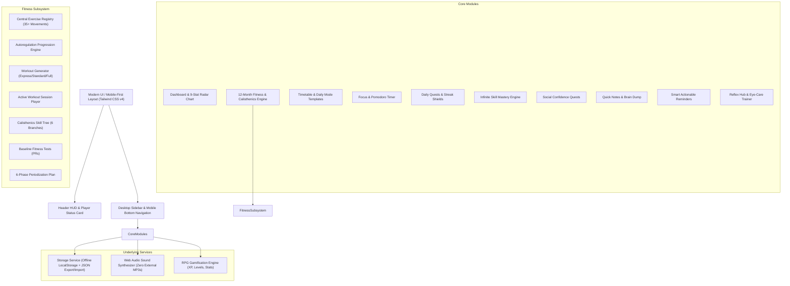

# ⚔️ Level Up / Better Me — Personal Life OS

> **A Gamified Self-Mastery & Real-Life RPG Operating System** designed to bridge physical capability, mental focus, social charisma, and academic/career discipline into a unified personal dashboard.

[](https://react.dev/)
[](https://www.typescriptlang.org/)
[](https://tailwindcss.com/)
[](https://vitejs.dev/)
[](#)
[](#)
[](https://opensource.org/licenses/MIT)

[](https://vercel.com/new/clone?repository-url=https://github.com/ashinmathai33-hash/new)
[](https://app.netlify.com/start/deploy?repository=https://github.com/ashinmathai33-hash/new)

**Official Repository**: [https://github.com/ashinmathai33-hash/new.git](https://github.com/ashinmathai33-hash/new.git)

---

## 🌟 Executive Summary

**Level Up / Better Me** treats real life as an RPG where **you are the character**. Every push-up completed, book chapter read, 25-minute deep focus block finished, or social comfort-zone challenge conquered earns real XP, levels up your avatar, and permanently develops your 9 core character attributes:

1. **Strength** (Muscular power & compound bodyweight mastery)
2. **Stamina** (Cardiovascular capacity & aerobic endurance)
3. **Focus** (Sustained deep work & distraction resistance)
4. **Reflex** (Neural reaction speed & agile motor coordination)
5. **Awareness** (Mindfulness, posture, eye-care & sensory observation)
6. **Knowledge** (Continuous learning, reading, software & theory)
7. **Recovery** (Sleep, joint decompression, stretching & parasympathetic rest)
8. **Confidence** (Public speaking, vocal projection, eye contact & charisma)
9. **Discipline** (Consistency, streak maintenance & habit adherence)

---

## 🏗️ Architecture & Tech Stack



### Technology Highlights
- **Framework**: React 19 with TypeScript for strict type-safety across all models.
- **Styling**: Tailwind CSS v4 with dark cyber-slate palette, neon accents, and backdrop blur.
- **Iconography**: Lucide React.
- **Animations & Effects**: Canvas Confetti for PRs and Level-Ups; pure CSS keyframe transitions.
- **Audio**: Custom **Web Audio API synthesizer** generating chimes, timer ticks, level-up fanfares, and quest completions with **zero external audio files or network latency**.
- **Data Persistence**: Offline-first LocalStorage with full JSON backup, export, and restore.

---

## 📦 Detailed Module Breakdown

### 1. 🏋️‍♂️ 12-Month Fitness & Calisthenics Engine
Designed for beginners starting with ~10 push-ups and low stamina, built around **Autoregulation** rather than arbitrary 7-day rep increases:
- **Central Exercise Registry (`exerciseRegistry.ts`)**: 35+ fully structured exercises across **15 categories**:
  - *Chest, Back, Shoulders, Biceps, Triceps, Forearms, Core/Abs, Glutes, Quadriceps, Hamstrings, Calves, Full Body, Cardio/Stamina, Mobility, Calisthenics Skills*.
- **Two Distinct Training Environments**:
  - `HOME`: Uses floor, wall, bed, chair, desk/table, backpack, and pull-up bar.
  - `HOSTEL`: Strictly zero equipment, small footprint, 100% quiet (`isQuietForHostel: true`), no jumping or floor vibration.
- **Autoregulation Progression Engine (`progressionEngine.ts`)**:
  - Evaluates actual completed sets, reps, perceived exertion (**RPE**), and **Form Quality** (*Good*, *Minor Mistakes*, *Poor*).
  - Protects tendons and ligaments: reduces reps by 2 if form breaks down 2+ times; increases reps by +1 to +2 when clean and moderate; unlocks next progression when ceiling is mastered.
  - Cardio stamina ladder from 5 mins up to 35+ continuous minutes.
- **Workout Generator (`workoutGenerator.ts`)**:
  - Guarantees workouts are strictly **$\le 60$ minutes** across 3 tiers: **Express (15–20m)**, **Standard (30–40m)**, and **Full (45–55m)**.
  - Weekly Split: *Mon: Push+Core, Tue: Legs+Cardio, Wed: Active Recovery, Thu: Pull+Core, Fri: Full Body, Sat: Calisthenics Skills, Sun: Rest*.
- **Active Workout Session Player (`ActiveWorkoutSession.tsx`)**:
  - Sequential exercise runner, live rep counter, isometric hold countdown timer, automatic rest timer with coaching cues, interactive SVG visual guide, post-exercise evaluation questionnaire, and confetti finish screen.
- **RPG Calisthenics Skill Tree (`CalisthenicsSkillTree.tsx`)**:
  - 6 Branches: **Push**, **Pull**, **Core**, **Shoulders**, **Legs**, and **Balance**.
  - Node status (*Locked*, *Unlocked*, *Mastered*) with prerequisites and XP rewards.
- **Baseline Fitness Benchmark Tests (`FitnessBenchmarkTests.tsx`)**:
  - Personal record (PR) testing: *Max Push-ups, Plank Hold, 2-Min Squats, Dead Hang, Max Pull-ups, Hollow Body Hold, Cardio Stamina*.
- **12-Month Periodization Roadmap (`Roadmap12MonthView.tsx`)**:
  - 6 Phases from *Foundation & Joint Integrity* to *Calisthenics Mastery & Autoregulated Peak*.

---

### 2. ⚡ Dashboard & Character HUD
- **Player Status Card**: Real-time Level, Current XP, Today's XP, Total XP, and Title progression (Apprentice $\to$ Hunter $\to$ Master).
- **Stat Radar Chart**: Visual SVG polygon displaying all 9 character stats.
- **Streak Shields & Anti-Burnout Recovery**: Bankable streak shields that auto-protect streaks during exam weeks or sickness.
- **Daily Quest Overview**: Quick-check daily habit checklist.

---

### 3. 📅 Dynamic Timetable & Mode Switcher
- **Context Templates**: Pre-configured modes for **College**, **Exam Mode**, **Work**, **Vacation**, **Deep Work**, and **Recovery**.
- **Daily Schedule**: Time-blocked schedule from morning routine to bedtime with color-coded categories.
- **Date-Mode Mapping**: Assign specific modes to dates (e.g. Exam Mode during finals week).

---

### 4. 🧠 Focus & Deep Work Engine
- **Customizable Timers**: Pomodoro (25/5), Long Focus (50/10), or Custom intervals.
- **Synthesized Ambient Noise**: White noise, pink noise, and rain hum built using the Web Audio API.
- **Session Logging**: Automatically tracks deep focus minutes and awards Focus & Discipline XP.

---

### 5. 🎯 Quests & Habit System
- **Daily Quests**: Morning Routine, Bodyweight Training, Deep Focus Block, Reading Habit, Social Quest.
- **Streak Calculation**: Increments on consecutive active days; alerts user when streak is vulnerable.
- **Custom Quest Creation**: Add custom personal quests with target XP values.

---

### 6. 🗣️ Social Confidence & Charisma Quests
- **Tiered Social Challenges**:
  - *Tier 1 (Comfortable)*: Hold eye contact and smile, give a genuine compliment.
  - *Tier 2 (Growth)*: Ask a stranger for directions or time, speak up in a lecture/meeting.
  - *Tier 3 (Bold)*: Deliver an impromptu 2-minute speech, start a conversation with someone new.
  - *Tier 4 (Legendary)*: Public presentation or debate participation.
- Directly builds **Confidence** and **Knowledge** character stats.

---

### 7. 🎸 Infinite Skill Mastery Engine
- **Skill Tracking**: Software Engineering, Public Speaking, Speed Reading, Calisthenics, Meditation, Music, Languages.
- **Infinite Leveling**: No level cap; XP requirements scale progressively.
- **1-Click Practice Timer**: Stopwatch with ambient audio that logs practice minutes, prompts for a 1-sentence learning takeaway, and awards XP.

---

### 8. 📝 Quick Notes & Brain Dump
- Fast markdown note capture with search, pin, and tag filtering.
- Supports ideas, learning takeaways, and workout observations.

---

### 9. ⏰ Smart Actionable Reminders
- Time-sensitive reminders with priority levels (Low, Medium, High).
- Quick snooze and one-click completion.

---

### 10. 👁️ Eye-Care & Neural Reflex Tester
- **EyeCare Trainer**: 20-20-20 rule timer, blinking exercises, and ocular muscle release guides to prevent digital eye strain.
- **Reflex Hub**: Millisecond digital tap tester measuring neural reaction time with high-score tracking and agility drills.

---

## 🛠️ Getting Started & Installation

### Prerequisites
- [Node.js](https://nodejs.org/) (v18 or higher recommended)
- `npm` or `pnpm`

### Installation Steps

1. **Clone the repository**:
   ```bash
   git clone https://github.com/ashinmathai33-hash/new.git
   cd new
   ```

2. **Install dependencies**:
   ```bash
   npm install
   ```

3. **Start the local development server**:
   ```bash
   npm run dev
   ```
   Open [http://localhost:5173](http://localhost:5173) in your browser.

4. **Verify TypeScript compilation**:
   ```bash
   npx tsc -b
   ```

5. **Build for production**:
   ```bash
   npm run build
   ```

---

## 🔒 Offline & Data Safety
- All profile data, progression states, workout logs, notes, and skills are stored locally in the browser's `localStorage`.
- No account registration or external server is required.
- **Full Backup & Restore**: Head to **Settings** $\to$ **Data Backup** to export your entire Life OS state as a single JSON file or restore from a previous backup.

---

## 📄 License
This project is open-source and available under the **MIT License**.
